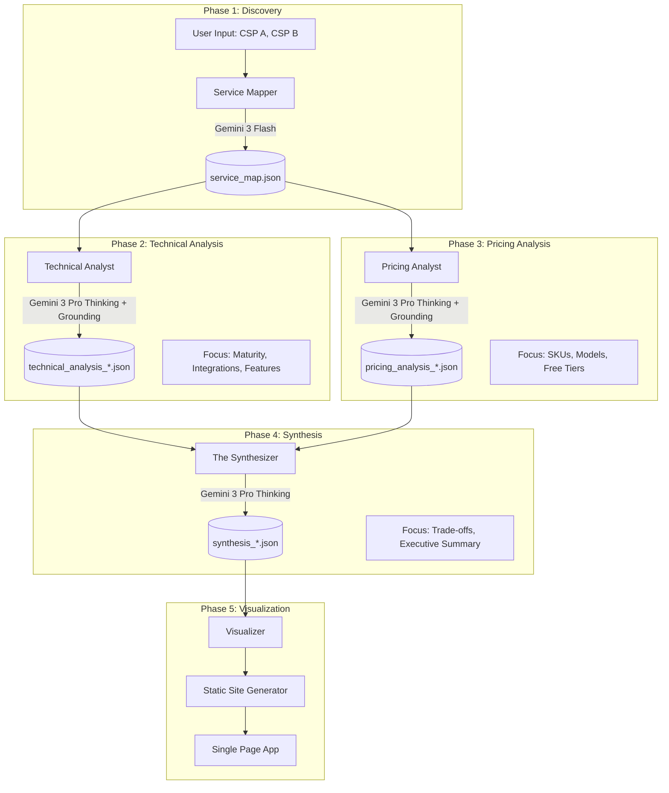

# Cloud Service Provider (CSP) Comparator Pipeline

## 1.0 Project Overview
This project automates the comprehensive comparison of two Cloud Service Providers (e.g., AWS vs. GCP) using a Generative AI pipeline. The system identifies equivalent services, performs deep-dive architectural and pricing analysis, and generates a static HTML dashboard for visualization.

A required step is to generate a service_list file for each CSP, as this was not possible in acceptable quality in the tool itself.

**Key Features:**
*   **Automated Discovery:** Maps services from CSP A to CSP B using high-speed LLMs.
*   **Deep-Dive Analysis:** Uses reasoning models (Thinking Mode) with **Google Search Grounding** to analyze documentation, pricing, and user sentiment.
*   **Quantifiable Scoring:** Generates normalized scores (-10 to +10) comparing maturity, flexibility, and quality.
*   **Schema-Driven:** Enforces strict JSON output for deterministic data handling.
*   **Cloud-Native:** Runs on Google Cloud Platform (Cloud Run Jobs + GCS) with Terraform IaC.

## 2.0 Architecture

### High-Level Data Flow



## 3.0 Getting Started

### Prerequisites
*   Python 3.8+
*   Terraform
*   Google Cloud SDK

### GCP Setup
1.  **Create a GCP Project:** If you don't have one already, create a new project in the [Google Cloud Console](https://console.cloud.google.com/).
2.  **Enable APIs:** Enable the following APIs for your project:
    *   `cloudresourcemanager.googleapis.com`
    *   All the others will be done by terraform
3.  **Authenticate:** Authenticate your local environment:
    ```bash
    gcloud auth application-default login
    ```
4.  **Create a Service Account:** The Cloud Run Job requires a dedicated Service Account with permissions for Vertex AI and Cloud Storage.
    ```bash
    # Replace <PROJECT_ID> with your GCP Project ID
    export PROJECT_ID=<PROJECT_ID>
    export SA_NAME="csp-comparator-sa"
    export SA_EMAIL="${SA_NAME}@${PROJECT_ID}.iam.gserviceaccount.com"

    # set project_id if on gcloud shell
    gcloud config set project ${PROJECT_ID}

    # Create the service account
    gcloud iam service-accounts create ${SA_NAME} --display-name="CSP Comparator Service Account"

    # Grant permissions to the service account
    gcloud projects add-iam-policy-binding ${PROJECT_ID} --member="serviceAccount:${SA_EMAIL}" --role="roles/aiplatform.user"
    gcloud projects add-iam-policy-binding ${PROJECT_ID} --member="serviceAccount:${SA_EMAIL}" --role="roles/storage.objectAdmin"
    ```

### Installation
1.  **Clone the repository:**
    ```bash
    git clone <repository-url>
    cd <repository-directory>
    ```
2.  **Create and activate a virtual environment:**
    ```bash
    python3 -m venv venv
    source venv/bin/activate
    ```
3.  **Install dependencies:**
    ```bash
    pip install -r requirements.txt
    ```

## 4.0 Execution

### Infrastructure Deployment
1.  **Navigate to the terraform directory:**
    ```bash
    cd terraform
    ```
2.  **Initialize Terraform:**
    ```bash
    terraform init
    ```
3.  **Apply the configuration:** You will be prompted to enter the required variables.
    ```bash
    terraform apply
    ```

### Local Pipeline Run
To run the pipeline locally, use the `run_local.sh` script:
```bash
./scripts/run_local.sh --csp-a "AWS" --csp-b "GCP" --test
```
*   `--csp-a`: The first Cloud Service Provider.
*   `--csp-b`: The second Cloud Service Provider.
*   `--test`: (Optional) Runs the pipeline in test mode, limiting the analysis to the first 3 services found.

**Note:** Running the script without the `--test` flag will execute the pipeline in "pro mode," which connects to live Google Cloud services and will incur costs. Ensure you have authenticated with `gcloud auth application-default login` before running in this mode.

### Cloud Pipeline Run
To run the pipeline in a serverless environment, trigger the Cloud Run Job created by Terraform.

## 5.0 Configuration

### Environment Variables
The pipeline uses the following environment variables for configuration:
*   `GCP_PROJECT_ID`: Your Google Cloud Project ID.
*   `BUCKET_NAME`: The name of the GCS bucket for data and web hosting.
*   `AI_LOCATION`: The Vertex AI region (e.g., `us-central1`).
*   `TEST`: Set to `true` to limit processing to the top 3 services.

### Terraform Variables
The following variables are used in the Terraform configuration:
*   `project_id`: Your Google Cloud Project ID.
*   `region`: The GCP region for resources.
*   `bucket_name`: The name for the GCS bucket.
*   `container_image`: The container image URI for the pipeline job.
*   `service_account_email`: The service account email to run the job as.

## 6.0 Project Structure
```
/
├── assets/
│   ├── json/
│   └── templates/
├── pipeline/
├── scripts/
├── terraform/
├── config.py
├── constants.py
├── main.py
└── requirements.txt
```
*   **assets/**: Contains JSON schemas, prompts, and HTML templates.
*   **pipeline/**: The core logic for each phase of the pipeline.
*   **scripts/**: Helper scripts for deployment and execution.
*   **terraform/**: Infrastructure as Code for GCP resources.

## 7.0 Output
The pipeline generates a single-page HTML application as a dashboard, which is stored in the `public/` directory of the GCS bucket.
