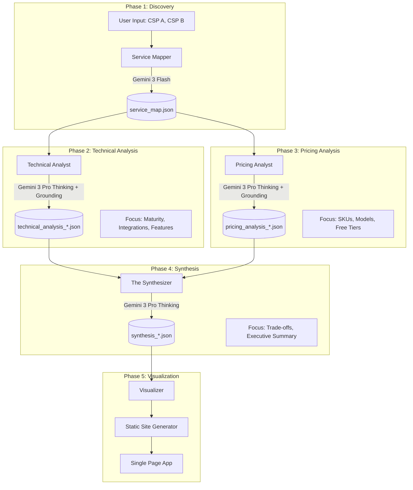

# Cloud Service Provider (CSP) Comparator Pipeline

## 1.0 Project Overview
**Objective:** Automate the comprehensive comparison of two Cloud Service Providers (e.g., AWS vs. GCP) using a Generative AI pipeline. The system identifies equivalent services, performs deep-dive architectural and pricing analysis, and generates a static HTML dashboard for visualization.

**Key Features:**
* **Automated Discovery:** Maps services from CSP A to CSP B using high-speed LLMs.
* **Deep-Dive Analysis:** Uses reasoning models (Thinking Mode) with **Google Search Grounding** to analyze documentation, pricing, and user sentiment.
* **Quantifiable Scoring:** Generates normalized scores (-10 to +10) comparing maturity, flexibility, and quality.
* **Schema-Driven:** Enforces strict JSON output for deterministic data handling.
* **Cloud-Native:** Runs on Google Cloud Platform (Cloud Run Jobs + GCS) with Terraform IaC.
---

## 2.0 Architecture

### 2.1 High-Level Data Flow


### 2.2 Core Components

#### The Service Mapper (discovery.py):

* Model: Gemini 3 Flash.
* Function: Scrapes/Retrieves the full service catalog of CSP A and attempts to find the closest semantic equivalent in CSP B.
* Output: A mapping JSON containing service names and links to official documentation.

#### The Comparison Engine (analyzer.py):

* Model: Gemini Reasoning Model (e.g., 3 Pro Thinking).
* Capabilities: Enabled with Vertex AI Grounding to access documentation and recent user reports.
* Logic:
   * Fetches Docs (via Grounding).
   * Evaluates Maturity, SKUs, Pros/Cons.
   * Assigns Score (-10 to +10).
* Output: Validated JSON files per service pair.

#### Pricing Analyst (pricing_analyst.py): 
* Model: Gemini Reasoning Model (e.g., 3 Pro Thinking).
* Capabilities: Enabled with Vertex AI Grounding to access pricing data from the vendor and recent pricing reports.
* Logic:
   * Fetches pricing data (via Grounding) for SKUs, On-Demand rates, Spot instances, and Free Tiers.
   * Evaluates prices per unit, special rebates and offers
   * Assigns Score (-10 to +10).
* Output: Validated JSON files per service pair.

#### The Synthesizer (synthesizer.py):

* **Model:** Gemini Reasoning Model (e.g., 3 Pro Thinking).
* **Capabilities:** Pure context processing (no external Grounding required); specialized in narrative generation and complex trade-off analysis.
* **Logic:**
    * Ingests validated JSONs from Technical and Pricing phases.
    * Synthesizes a holistic view, weighing "Value for Money" (Cost vs. Quality).
    * Generates a detailed Markdown comparison essay.
    * Distills findings into a strict <300 character executive summary (enforced by schema).
* **Output of the request to the model:** Validated JSON file containing the narrative elements.
* **Merge:** Consolidates the technical data, pricing data, and narrative into a single **`result.json`** artifact per CSP Pair and stores it.

#### The Dashboard Generator (visualizer.py):

   * Function: Aggregates individual JSON results.
   * presents the synthesis
   * presents a foldable table of the details for all services sorted by domains (Compute, Storage, Database, AI, Security) with sums of the numerical values per domain
   * Logic: Computes statistics (averages per domain (Compute, Storage, Database, AI, Security), win/loss ratios) and renders a single-page HTML application.

---
## 3.0 Technical Stack & Standards
### 3.1 Infrastructure (Terraform)
* Compute: Google Cloud Run Jobs (for long-running, serverless execution).
* Storage: Google Cloud Storage (GCS) for:
  * raw/: Intermediate schemas and prompts.
  * data/: Generated JSON comparisons.
  * public/: Hosted static HTML dashboard.
* AI: Vertex AI Model Garden & Index Endpoints.

### 3.2 Python Development
* Style: PEP 8, Type Hinting (Strict).
* Resilience: Exponential backoff for all Vertex AI calls.
* Configuration:
  * config.py: Loads environment variables.
  * constants.py: Hardcoded values (e.g., model versions).
  * assets/json/: Externalized prompts and JSON schemas.

### 3.3 Directory Structure
```text
/
├── assets/
│   ├── json/
│   │   ├── prompt_config.json      # All prompts
│   │   ├── service_map_schema.json # Output schema for Phase 1
│   │   └── comparison_schema.json  # Output schema for Phase 2
│   └── templates/
│       └── dashboard.html          # Jinja2 template for the frontend
├── pipeline/
│   ├── __init__.py
│   ├── discovery.py                # Phase 1 logic
│   ├── pricing_analyst.py          # Phase 2
│   ├── analyzer.py                 # Phase 3 logic
│   ├── synthesizer.py              # Phase 4 logic
│   └── visualizer.py               # Phase 5 logic
├── scripts/                        # Automation & Ops
│   ├── deploy.sh
│   ├── run_cloud.sh
│   ├── run_local.sh
│   └── reset_datastores.sh
├── terraform/                      # Infrastructure as Code
│   ├── main.tf
│   ├── variables.tf
│   └── outputs.tf
├── config.py                       # Env var loader
├── constants.py                    # Project constants
├── main.py                         # Entry point / Orchestrator
└── requirements.txt
```

### 3.4 Configuration
#### 3.4.1 Environment Variables
| Variable | Source | Description |
| :--- | :--- | :--- |
| `GCP_PROJECT_ID` | Terraform Output | Google Cloud Project ID. |
| `BUCKET_NAME` | Terraform Output | GCS Bucket for data & web hosting. |
| `AI_LOCATION` | Terraform Output | Vertex AI region (e.g., us-central1). |
| `TEST` | User Input | `true` limits processing to top 3 services and forces regeneration of cached JSONs. |

#### 3.4.2 Logging
* Production: INFO level. Suppress urllib3 and google.auth.
* Test: INFO (Detailed step-by-step)

### 3.5 Execution Workflow
* Initialize Infrastructure:Bashcd terraform && terraform apply
* Run Pipeline (Local Dev):Bash./scripts/run_local.sh --csp-a "AWS" --csp-b "GCP"
* View Results:Open the generated HTML file in gs://<BUCKET_NAME>/public/$CSPA_$CSPB_$DATETIME.html

### 4. Data Schemas
All AI outputs are strictly typed.

### 4.1 Service Map Schema
File: assets/json/service_map_schema.json
```json
{
  "type": "object",
  "properties": {
    "items": {
      "type": "array",
      "items": {
        "type": "object",
        "properties": {
          "domain": { "type": "string" },
          "csp_a_service_name": { "type": "string" },
          "csp_a_url": { "type": "string", "format": "uri" },
          "csp_b_service_name": { "type": ["string", "null"] },
          "csp_b_url": { "type": ["string", "null"], "format": "uri" }
        },
        "required": ["domain", "csp_a_service_name"]
      }
    }
  },
  "required": ["items"]
}
```

### 4.2 Technical Analysis Schema
File: assets/json/technical_schema.json

```json
{
  "type": "object",
  "properties": {
    "service_pair_id": { "type": "string" },
    "maturity_analysis": {
      "type": "string",
      "description": "Evaluation of stability, SLAs, and enterprise readiness."
    },
    "integration_quality": {
      "type": "string",
      "description": "Assessment of SDKs, ecosystem, and versatility."
    },
    "technical_advantages_a": { "type": "array", "items": { "type": "string" } },
    "technical_advantages_b": { "type": "array", "items": { "type": "string" } },
    "technical_score": {
      "type": "number",
      "minimum": -10,
      "maximum": 10,
      "description": "Score based purely on quality/features. -10 (B worse) to +10 (B better)."
    },
    "technical_reasoning": { "type": "string" }
  },
  "required": ["service_pair_id", "maturity_analysis", "integration_quality", "technical_score", "technical_reasoning"]
}
```

### 4.3 Pricing Analysis Schema
File: assets/json/pricing_schema.json

```json
{
  "type": "object",
  "properties": {
    "service_pair_id": { "type": "string" },
    "pricing_models": {
      "type": "array",
      "items": { "type": "string" },
      "description": "List of billing methods (e.g. 'On-Demand', 'Spot', 'Committed Use')."
    },
    "free_tier_comparison": {
      "type": "string",
      "description": "Direct comparison of free tier limits."
    },
    "pricing_advantages_a": { "type": "array", "items": { "type": "string" } },
    "pricing_advantages_b": { "type": "array", "items": { "type": "string" } },
    "cost_efficiency_score": {
      "type": "number",
      "minimum": -10,
      "maximum": 10,
      "description": "Score based purely on cost. -10 (B expensive) to +10 (B cheaper)."
    },
    "pricing_reasoning": { "type": "string" }
  },
  "required": ["service_pair_id", "pricing_models", "free_tier_comparison", "cost_efficiency_score", "pricing_reasoning"]
}
```

### 4.4 Synthesis schema
File: assets/json/synthesis_schema.json
```json
{
  "type": "object",
  "properties": {
    "service_pair_id": {
      "type": "string",
      "description": "Unique identifier to link back to technical and pricing data."
    },
    "detailed_comparison": {
      "type": "string",
      "description": "A comprehensive Markdown essay synthesizing technical and pricing findings."
    },
    "executive_summary": {
      "type": "string",
      "maxLength": 300,
      "description": "A high-impact summary strictly under 300 characters."
    }
  },
  "required": [
    "service_pair_id",
    "detailed_comparison",
    "executive_summary"
  ]
}
```

### result schema
File: assets/json/result_schema.json
```json
{
  "type": "object",
  "properties": {
    "metadata": {
      "type": "object",
      "properties": {
        "service_pair_id": { "type": "string" },
        "generated_at": { "type": "string", "format": "date-time" },
        "model_version": { "type": "string" }
      },
      "required": ["service_pair_id", "generated_at"]
    },
    "technical_data": {
      "type": "object",
      "description": "The complete object from Phase 2 (Technical Analysis).",
      "required": ["maturity_analysis", "integration_quality", "technical_score"]
    },
    "pricing_data": {
      "type": "object",
      "description": "The complete object from Phase 3 (Pricing Analysis).",
      "required": ["pricing_models", "cost_efficiency_score"]
    },
    "synthesis": {
      "type": "object",
      "properties": {
        "detailed_comparison": {
          "type": "string",
          "description": "A comprehensive Markdown essay synthesizing technical and pricing findings."
        },
        "executive_summary": {
          "type": "string",
          "maxLength": 300,
          "description": "A high-impact summary strictly under 300 characters."
        }
      },
      "required": ["detailed_comparison", "executive_summary"]
    }
  },
  "required": ["metadata", "technical_data", "pricing_data", "synthesis"]
}
```


## 5.0 Prompts (prompt_config.json)


File: `assets/json/prompt_config.json`
```json
{
  "discovery_prompt": {
    "system_instruction": "You are a Senior Cloud Architect. Map services based on functional equivalence.",
    "user_template": "Analyze the service catalog for {csp_a} and {csp_b}. For each and every service in {csp_a} **making double sure to get a complete list and not forget a single service**, find the direct equivalent in {csp_b}.\n\nOutput strict JSON with names and doc URLs.",
    "description": "Maps services from CSP A to CSP B."
  },
  "technical_prompt": {
    "system_instruction": "You are a Principal Cloud Consultant. You ignore pricing entirely. You focus on 'Service Quality': Maturity, Versatility, integration options, Features and Developer Experience.",
    "user_template": "Compare the technical quality of these two services:\n\n1. {csp_a} Service: {service_a_name} ({service_a_url})\n2. {csp_b} Service: {service_b_name} ({service_b_url})\n\nTasks:\n1. **Maturity:** Evaluate historical stability, SLAs, and feature depth.\n2. **Versatility:** How adaptable is it? (e.g., bare metal vs. serverless options within the service).\n3. **Integrations:** Evaluate the richness of the SDKs and 3rd-party ecosystem.\n\nScoring (-10 to +10):\n- -10: B is technically inferior/immature.\n- 0: Identical technical capabilities.\n- +10: B is technically superior, more versatile, or has better integrations.\n\nOutput strict JSON.",
    "description": "Analyzes feature set, maturity, and integration quality."
  },
  "pricing_prompt": {
    "system_instruction": "You are a Cloud FinOps Expert. Your sole focus is Cost, Licensing, and Billing Models. You do not care about features, only value-for-money.",
    "user_template": "Compare the pricing models of:\n\n1. {csp_a}: {service_a_name}\n2. {csp_b}: {service_b_name}\n\nTasks:\n1. Identify the Pricing Models (e.g., Per Second, Per Request, Provisioned).\n2. List major SKUs/Variations (e.g., Standard, Premium, Spot).\n3. Analyze the Free Tier offerings.\n4. Determine which is generally more cost-effective for a typical startup workload.\n\nScoring (-10 to +10):\n- -10: B is significantly more expensive or has a hostile billing model.\n- 0: Pricing is effectively at parity.\n- +10: B is significantly cheaper or offers a generous free tier.\n\nOutput strict JSON.",
    "description": "Analyzes pricing models, SKUs, and cost efficiency."
  },
  "synthesis_prompt": {
    "system_instruction": "You are a Chief Technology Officer (CTO) summarizing a vendor selection process. You are concise, decisive, and persuasive. You synthesize technical quality and cost efficiency into a cohesive narrative.",
    "user_template": "Review the following two analysis reports for the service pair {service_pair_id}:\n\nTechnical Analysis:\n{technical_json}\n\nPricing Analysis:\n{pricing_json}\n\nTasks:\n1. Write a 'Detailed Comparison' (Markdown). Synthesize the pros/cons of both. use (Compute, Storage, Database, AI, Security) domains of services and generate a sumamry for each. Explain the trade-offs between cost and quality. Who should use which?\n2. Write an 'Executive Summary'. This must be a single paragraph, strictly under 300 characters. It must declare a winner or a specific use-case split.\n\nOutput strict JSON.",
    "description": "Merges technical and pricing data into a human-readable narrative."
  }
}
```


